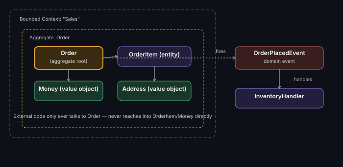

# Aggregates and Aggregate Roots

**Aggregate:** a cluster of related entities/value objects treated as a
single unit for data changes. **Aggregate Root:** the one entity through
which all external access to the aggregate must go.

```java
class Order { // aggregate root
    private List<OrderItem> items; // only reachable through Order
    void addItem(Item i) { /* enforces invariants, e.g. max 50 items */ }
}
// External code should never do: order.items.add(...) directly
```



## Key points
- The aggregate root is responsible for enforcing invariants across the
  whole cluster — external code shouldn't reach into internals and modify
  a child directly, bypassing the root's rules
- This is [Composition](../../class-relationships/composition.md) +
  [Encapsulation](../../oop-fundamentals/encapsulation.md) applied at a
  domain-modeling level, with an explicit name for the "who's in charge" role

**Remember:** for Splitwise/e-commerce-style problems, explicitly naming
your aggregate roots (Order, Group, Expense) and what they protect is a
strong way to show you're thinking beyond just class diagrams.

---
*Part of [LLD & OOD Interview Prep](../../../README.md)*
