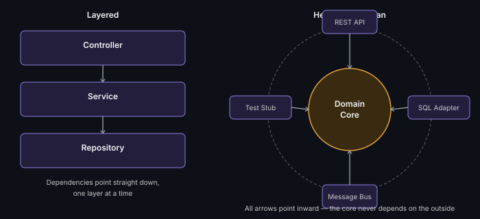

# Hexagonal / Clean Architecture

Put business logic (the "domain core") at the center, with everything
external — database, UI, third-party APIs — plugged in through
interfaces ("ports") at the edges. The core never depends on the outside;
the outside depends on the core.

```java
interface OrderRepository { void save(Order o); } // port — defined by the domain
class SqlOrderRepository implements OrderRepository { /* adapter — plugs in */ }
```



## When to use
When you want business logic fully independent of frameworks/databases —
easy to swap a database or test business logic without spinning up
infrastructure. Worth mentioning for senior-level "how would you structure
this codebase" follow-ups.

## When NOT to use
Overkill for a straightforward CRUD-shaped interview problem — Layered
Architecture is usually the better default unless asked specifically
about testability/framework independence.

**Remember:** the one-line distinction that shows understanding: "in
Layered, dependencies point downward through layers; in Hexagonal,
everything points inward toward the domain core."

---
*Part of [LLD & OOD Interview Prep](../../../README.md)*
