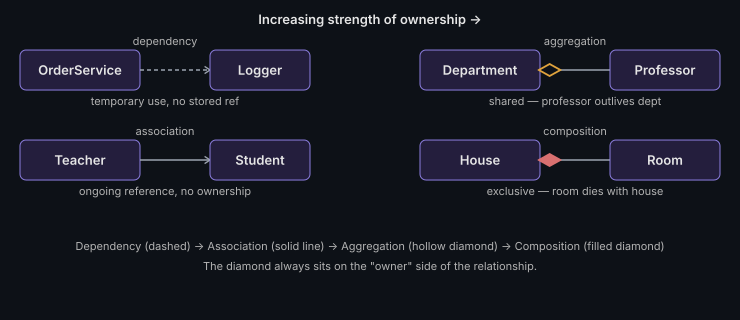

# Aggregation

A "has-a" relationship with **shared** ownership — the child can outlive
the parent.

```java
class Department {
    private List<Professor> professors; // professors exist independently
}
```



## Key points
- A `Professor` can belong to zero, one, or move between departments and still exist
- Represented in UML with a hollow diamond on the owner's side
- Weaker than composition — deleting the `Department` doesn't delete the `Professor` objects

**Remember:** the classic interview test — "if I delete the container, does
the contained object still make sense on its own?" Yes → aggregation.

---
*Part of [LLD & OOD Interview Prep](../../README.md)*
