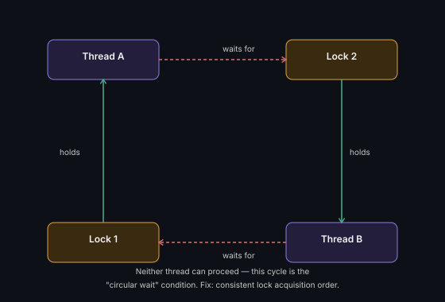

# Deadlock

Two or more threads are each waiting for a lock the other holds — nobody
can proceed, forever.

## The four necessary conditions (all must hold for deadlock to occur)
1. **Mutual exclusion** — resources can't be shared
2. **Hold and wait** — a thread holds one lock while waiting for another
3. **No preemption** — a lock can't be forcibly taken away
4. **Circular wait** — a cycle of threads each waiting on the next

## Prevention (break any one condition)
- **Lock ordering** — always acquire locks in the same global order across
  all code paths (breaks circular wait — the most common real fix)
- **Try-lock with timeout** — give up and retry instead of waiting
  forever (breaks hold-and-wait)

**Remember:** the fix to name in an interview is almost always **lock
ordering** — "I'd always acquire the lower account ID's lock first" is the
classic Bank Transfer deadlock-prevention answer.

---
*Part of [LLD & OOD Interview Prep](../../README.md)*
