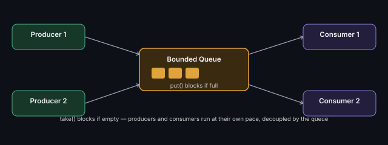

# Producer-Consumer Pattern

One or more **producer** threads generate work and put it on a shared
queue; one or more **consumer** threads take work off the queue and
process it — decouples production rate from consumption rate.



```java
BlockingQueue<Task> queue = new LinkedBlockingQueue<>(100); // bounded
// Producer: queue.put(task);   — blocks if queue is full (backpressure)
// Consumer: Task t = queue.take(); — blocks if queue is empty
```

## Key points
- A **bounded** queue is important — unbounded queues can grow without
  limit if producers outpace consumers, risking memory exhaustion (this
  is exactly the [backpressure](https://github.com/abhibatsa/architecting-software/blob/main/01-system-design-and-architecture/01-core-concepts/rate-limiting-and-backpressure.md) concept)
- `BlockingQueue` in Java already implements the wait/notify coordination
  internally — you rarely hand-roll this from scratch except as an
  explicit interview problem (see [Thread-Safe Blocking Queue](../concurrency-problems/thread-safe-blocking-queue.md))

**Remember:** this pattern is the backbone of most "design a concurrent
system" problems — logging systems, job queues, event processing all
reduce to some version of this.

---
*Part of [LLD & OOD Interview Prep](../../README.md)*
