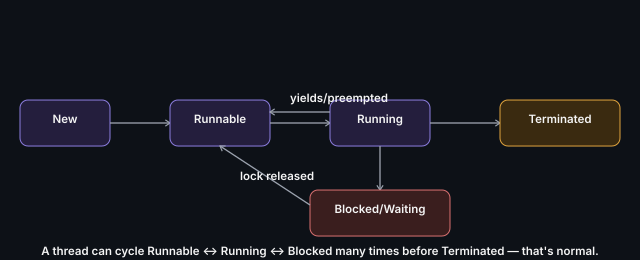

# Thread Lifecycle and States

A thread moves through a defined set of states from creation to
completion.

## The states
- **New** — created, not yet started
- **Runnable** — eligible to run, waiting for CPU time
- **Running** — actively executing
- **Blocked/Waiting** — paused, waiting on a lock, I/O, or another thread
- **Terminated** — finished execution

## Key points
- A thread can bounce between Runnable and Blocked many times before
  reaching Terminated — this is normal, not a bug
- Understanding this lifecycle is the foundation for debugging deadlocks
  (threads stuck in Blocked forever) and starvation (threads stuck cycling
  Runnable→Blocked without ever getting real CPU time)

**Remember:** if asked to debug a "hung" thread, the first question is
always "what state is it in, and what's it blocked on?"

---
*Part of [LLD & OOD Interview Prep](../../README.md)*
