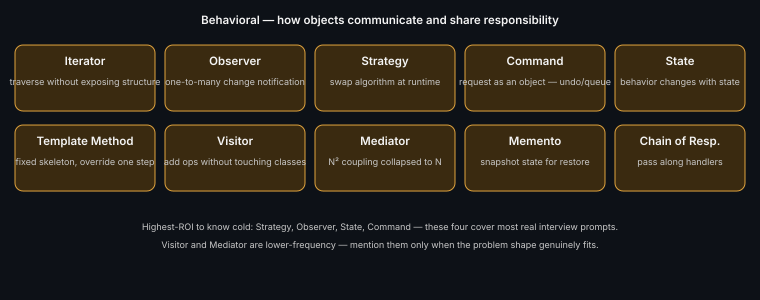

# Behavioral Patterns — Quick Index

[Iterator](./iterator.md) · [Observer](./observer.md) · [Strategy](./strategy.md) · [Command](./command.md) · [State](./state.md) · [Template Method](./template-method.md) · [Visitor](./visitor.md) · [Mediator](./mediator.md) · [Memento](./memento.md) · [Chain of Responsibility](./chain-of-responsibility.md)

---
*Part of [LLD & OOD Interview Prep](../../README.md)*
