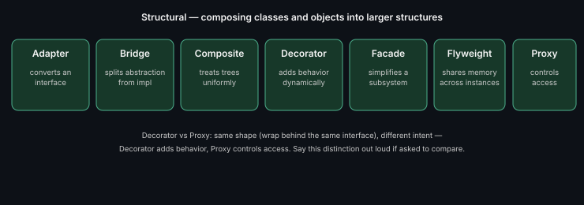

# Structural Patterns — Quick Index

[Adapter](./adapter.md) · [Bridge](./bridge.md) · [Composite](./composite.md) · [Decorator](./decorator.md) · [Facade](./facade.md) · [Flyweight](./flyweight.md) · [Proxy](./proxy.md)

---
*Part of [LLD & OOD Interview Prep](../../README.md)*
