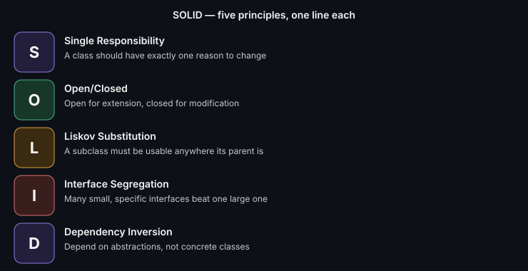

# SOLID Principles with Pictures

The five principles that keep an OOP design maintainable as it grows.
This doc is the quick visual map — see [SOLID with Code](./solid-with-code.md)
for implementations.

## The five, one line each

- **S — Single Responsibility:** a class should have exactly one reason to change
- **O — Open/Closed:** open for extension, closed for modification — add new behavior without editing existing code
- **L — Liskov Substitution:** a subclass must be usable anywhere its parent is expected, without breaking correctness
- **I — Interface Segregation:** many small, specific interfaces beat one large, general one
- **D — Dependency Inversion:** depend on abstractions, not concrete implementations

## The fastest way to remember them under pressure

Think of it as a story: **one job per class (S)** → **add features by
adding code, not editing it (O)** → **subtypes must honestly behave like
their parent (L)** → **don't force classes to implement methods they
don't need (I)** → **wire dependencies through interfaces, not concrete
classes (D)**.

---
*Part of [LLD & OOD Interview Prep](../../README.md)*
