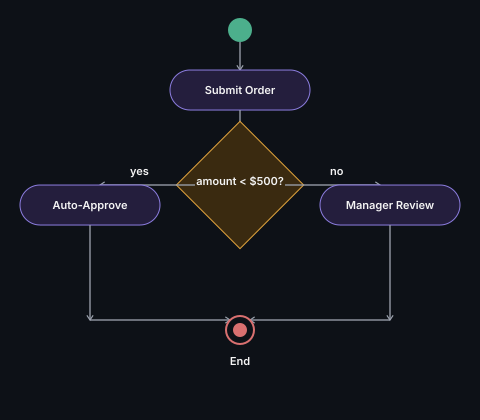

# Activity Diagram

Shows a workflow or business process as a flowchart — decisions,
parallel activities, start/end points.

## Key points
- Closer to a flowchart than a class-design tool — useful for showing
  *process logic* (e.g., order approval workflow with branches) rather
  than object collaboration
- Diamond = decision point, rounded rectangle = activity, filled circle = start, ringed circle = end

**Remember:** don't confuse this with a sequence diagram — activity
diagrams show *process flow/logic*, sequence diagrams show *object
message-passing*. If asked to model a workflow with branches, this is the
right tool.

---
*Part of [LLD & OOD Interview Prep](../../README.md)*
