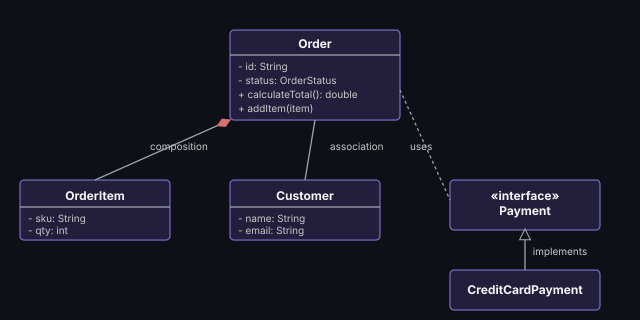

# Class Diagram

Shows classes, their attributes/methods, and relationships — the diagram
you'll actually draw in 90% of LLD interviews.

## Key notation to have memorized
- `+` public, `-` private, `#` protected
- Solid arrow = association, hollow diamond = aggregation, filled diamond = composition
- Hollow triangle arrow = inheritance/implements
- Dashed arrow = dependency

**Remember:** you don't need perfect UML syntax under interview pressure —
boxes with clear class names, key methods, and clearly-drawn relationship
lines communicate 90% of the value. Don't burn time perfecting arrowheads.

---
*Part of [LLD & OOD Interview Prep](../../README.md)*
