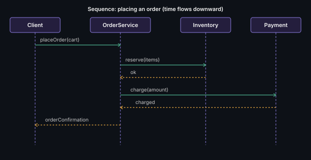

# Sequence Diagram

Shows objects and the order of messages (method calls) exchanged between
them over time — the best tool for walking through *one specific flow*.

## Key points
- Vertical lifelines = objects over time, horizontal arrows = method calls, in top-to-bottom chronological order
- Extremely high-value in interviews for showing a *specific* flow (e.g.,
  "place an order") after your class diagram is done — it proves your
  classes actually collaborate correctly
- Dashed return arrows show responses coming back

**Remember:** pick your *hardest* flow to sequence-diagram, not the
easiest one — that's where interviewers actually learn something about
your design.

---
*Part of [LLD & OOD Interview Prep](../../README.md)*
