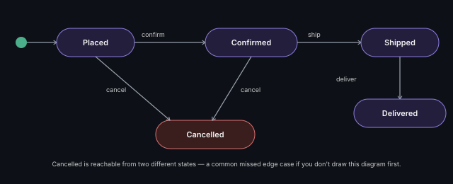

# State Machine Diagram

Shows the states an object can be in and the transitions between them —
the visual counterpart to the [State pattern](../design-patterns/behavioral/state.md).

## Key points
- Rounded rectangles = states, arrows = transitions (labeled with the
  triggering event)
- Directly maps to an [Enum](../oop-fundamentals/enums.md) + [State pattern](../design-patterns/behavioral/state.md)
  implementation — draw this diagram *before* coding any order/booking/
  traffic-light style problem, it prevents missed edge-case transitions

**Remember:** the most common interview miss isn't drawing the diagram
wrong — it's forgetting an edge transition (e.g., "can a Placed order go
straight to Cancelled without Shipping?"). Ask that question explicitly.

---
*Part of [LLD & OOD Interview Prep](../../README.md)*
