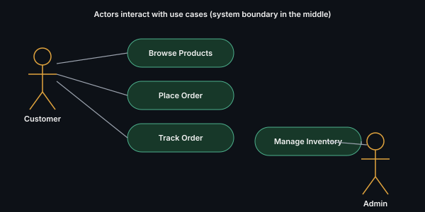

# Use Case Diagram

Shows actors (users/external systems) and the use cases (functional
requirements) they interact with — a requirements-gathering tool, not a
class-design tool.

## Key points
- Rarely the centerpiece of an LLD interview, but useful in the first two
  minutes to nail down scope — "here are the actors and what each can do"
  is a fast way to confirm requirements before designing classes
- Stick figures = actors, ovals = use cases, lines = interactions

**Remember:** if you're spending more than 2 minutes on this diagram in an
interview, you're spending time in the wrong place — move to class design.

---
*Part of [LLD & OOD Interview Prep](../../README.md)*
